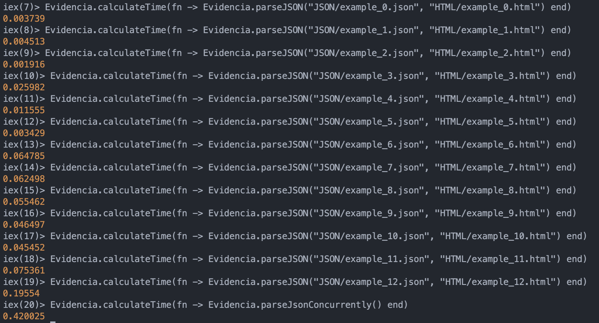

# Syntax Highlighter

Diego Araque and Francisco Salcedo

## How to run our program

First of all you should install elixir in your computer (the following link will help you to do that):
https://joyofelixir.com/a-setup-and-install

#### Start it from the Terminal

```
iex situacionProblema.exs
```

#### Read the JSON file and create de HTML file

```
Evidencia.parseJSON("path of the json file","path of the html file")
```

#### How to run our program concurrently

- If you want to parse all the files in the JSON folder run the following command in the terminal:
  ```
  Evidencia.parseJsonConcurrently()
  ```
- If you want to parse the files you want you should just include them in the JSON folder ande run the following command:
  ```
  Evidencia.parseJsonConcurrently([List of the files you want to parse])
  ```
  - An example could be:
    ```
    Evidencia.parseJsonConcurrently(["JSON/example_0.json","JSON/example_7.json", "JSON/example_12.json"])
    ```

## JSON tokens

- Object-Keys: They are strings that come before a colon (:). This token makes it easy to access values in our JSON.
  - Example -> "movie": 14 -> "movie" is the object key
- String: Its a group of characters that's inside quotaion marks
  - Example -> "movie:": "The Avengers" -> "The Avengers is the string"
- Number: It's a integer, exponential number and float
  - Example -> 340, 340.65, 340.4E+5 is a number
- Puntuation: It takes into consideration colons(:), comas(,), curly braces({}), brackets([])
  - Colons: Used after declaring an object key
  - Comas: Used to separate object keys or values inside of an array
  - Curly Braces: Used to initiate the JSON file and to create objects
  - Brackets: Used to create arrays

Bonus:

- Whitesapces: It is not a token, but our program reads every whitespace so the result in the HTML is formatted equally as the one in the JSON file.

## Regular Expressions

- Object Keys: ^"[-\w:]+"(?=:) -> It detects every set of characters inside of quotation marks and it has to end with a colon. It only matches if the beginning of the line matches this conditions.
- String: ^".\*?"(?![:]) -> It only matches the beginning of the line with any set of characters inside wuotation marks.
- Numbers: ^[-+]?\d*\.?\d+[eE]?[-+]?\d* -> It only matches when the beginning of the line has any of the numbers described in the JSON tokens section.
- Whitespaces: ^\s+ -> It only matches in the beginning of the line for one or more spaces.
- Puntuation: ^[{}\[\]:,] -> It matches in the beginning of a line where one of this characters ({}[]:,) is found
- Bool: ^true|^false -> It searchs for false or true in the beginning of the line
- Null: ^null -> It searchs for null in the beginning of the line.

## Reflection of our solution

The functionality of the prgram is the following:

- First of all the file is divided into lines
- Each line is analyzed. Everytime a regular expression matches with the beginning of the line, the matched part is taken out of the line and added to an htmlLine variable, which will consist of:
  html
  ```
  <span class="type-of-the-token">value-of-the-token</span>
  ```
- The function that replaces the string with an html span tag is called recursevly for each line, when the normal line is empty, it returns the html line and analyzes the next one.
- When the is completely parsed, it return a list. Which contains all the html tags and spaces of each line, so we join them to get a string.
- At last this final html is introduced to the basic HTML skeleton and its respective styling and date.

The solution proposed doesn't have a high complexity, because of that we are able to parse the files relatively faster.

In our opinion it can also be improved by adding different functionalities, so our code can parse other languages and not just JSON files. But it will be a lot more work since we will need to add syntax rules for each language and make the default code work for every single one. This wasn't done because it wasn't in the scope of the activity. But it can be seen as a future improvement.

## Algorithm complexity

Our algorithm is O(n), n being the number of tokens and spaces in the file. This is because the file is only looped once and it will read n amount of tokens.

## Time it takes



- Sequential Algorithm

  - When each file is called by itself it adds up to more time in total to the one we get in the concurrent function. Besides we need to type allf of this commands one by one. If we want to parse more and more .json files, this would have been very tedious and time consuming.
  - All 12 files add up to a total time of 0.83 seconds wich is 0.4 seconds slower than the other implementation. We also need to keep in mind the time you need to type each command, if we use more files and also bigger files, the difference in time will be bigger.

- Concurrent Algorithm
  - As we mentioned in the sequential section. This one is not only faster, but can read all the files of the JSON folder or the ones of your linking in one command.
  - This one lasts 0.4 second which it's twice as fast as the sequential one.
